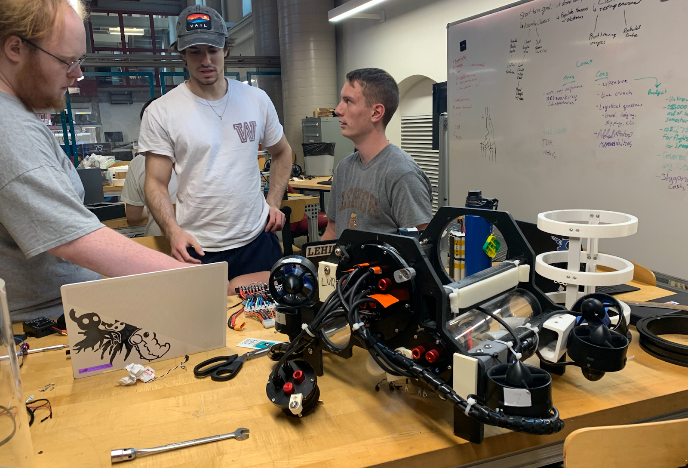

This week started with orientation being a success, the team got well acquainted with each other. We started to onboard the new members by explaining the competition guidelines, procedures, and components. Our team has three main subgroups, we have a mechanical, an electrical, and a software team. 
The mechanical team worked on taking existing inventory, reprinting thruster mounts, mounting thrusters, designing and 3D printing alternative clamps, measuring electronics components, assisting the electrical team with thruster positioning, creating miniature harness models, and finding suitable tools for drilling aluminum clamps. During the week they also continued to help the electrical team assemble connections between components on the drone. 
The electrical team started by using a schematic to find the necessary components to connect. After having established some connections, they began to test the connections between the electronic speed controllers (ESC) and the battery. Aside from continuing to search for the needed components, connecting them, and testing, during the week they also began troubleshooting issues with the PBC. 

The software team started by regaining access to the codes on GitHub and setting up proper documentation. Using the thrusters attached to the chassis they connected the controller and were able to make it respond. They then began to research ArduPilot to be able to work more on the Jetson. Towards the end of the week, they began attempting to write needed scripts for the components that were beginning to be connected properly. 

