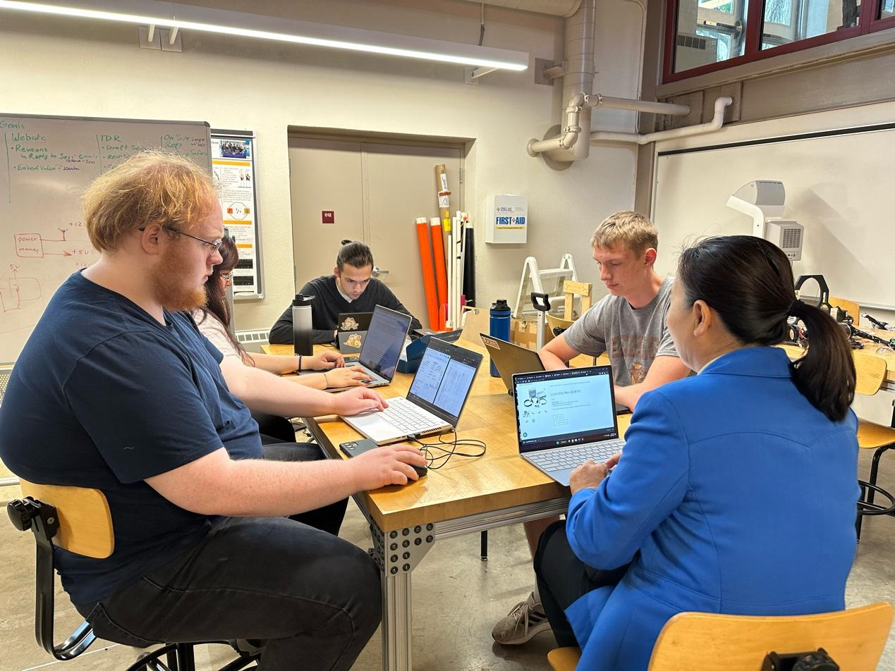

This past week was a significant one for our underwater drone project. The overall structure of the drone was constructed, and the first tests were performed in the pool. These tests are an essential part of the project as we started the collection of image data, which will later be used for our AI training with Jetson.

In the realm of design and construction, our mechanical team completed the technical design report, representing a critical milestone in the drone's development. The completion of the drone's structure marked the readiness for subsequent testing phases and fine-tuning, getting us one step closer to our goal.

Meanwhile, our software team was hard at work improving the drone's autonomous navigation abilities. They collected the necessary training data for the drone's computer vision system, with a specific emphasis on gate identification and interaction. The team also decided on implementing Simultaneous Localization and Mapping (SLAM) for creating a dynamic map of the drone's underwater environment. In addition to SLAM, they've chosen to use YOLOv8 & Roboflow for computer vision. This advanced technology combination is expected to substantially enhance the drone's object detection capabilities underwater.

On the electrical front, our team successfully worked out a cable management solution for 4 6-pin and 1 24-pin cables. This effort should enhance the drone's operational efficiency by ensuring a smooth electricity flow and minimizing technical hitches. They also presented a new schematic to the rest of the team for feedback and further improvement. Moreover, they have decided to incorporate sonar technology into the drone, a decision that will significantly improve its underwater navigation capabilities.

Finally, to engage with the public and generate interest in our project, our marketing team created a promotional video. This video showcases the project's objectives, the progress made so far, and the potential impact of our underwater drone.

To conclude, each team made significant strides this week, steadily progressing towards realizing the objectives of our underwater drone project. We look forward to sharing further updates in the coming weeks.
